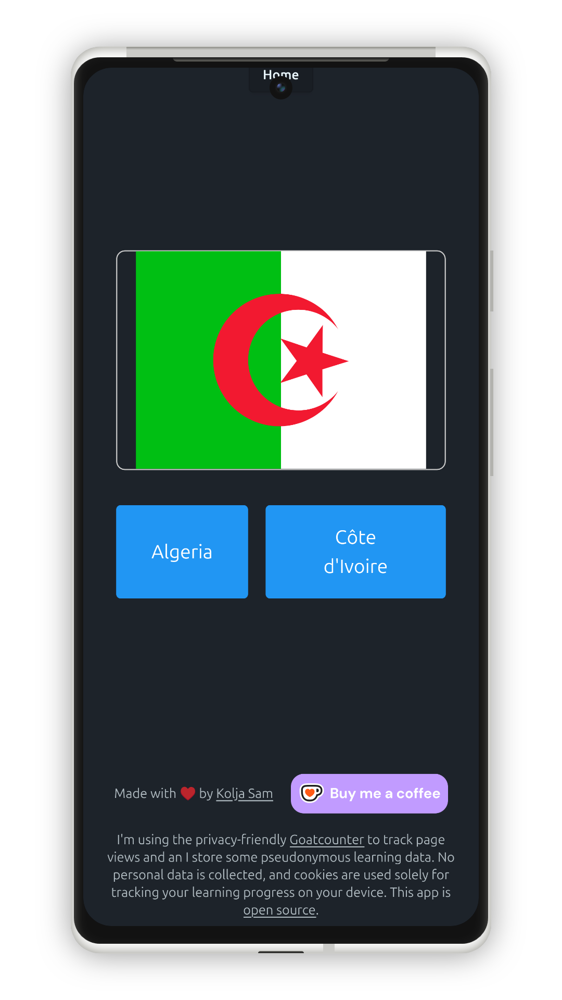

# Sam Learns Things

*Archived app. This was an early attempt in collecting small learning apps in one place — I quickly switched the idea to Django (see [this repo](https://github.com/koljapluemer/samlearns)), then froze the idea completely.*

One of the apps I started prototyping:

